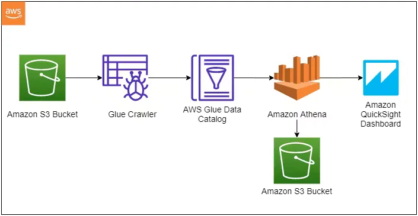

  

# About
                 

I am a Business Intelligence professional with 3 years of experience, holding a Master’s in Business Analytics from the University of Texas at Dallas. I specialize in data analysis, machine learning, and database management, with expertise in SQL, Python, and analytical tools like Power BI and Tableau. In my recent role as an Internal Audit Data Analytics Intern at Velera, I led a project to optimize resource allocation and improve team efficiency by 23%. I am a **Microsoft Certified Power BI Data Analyst Associate**, passionate about leveraging data to drive business performance and innovation.

# Coursework

### Educational Journey in Business Analytics

My educational journey is built on a foundation of rigorous coursework designed to develop both theoretical knowledge and practical skills in Business Analytics.

## Core Coursework

### Database Foundations for Business Analytics
- Explored fundamental and advanced concepts of database design.
- Focused on both SQL and NoSQL systems used in modern analytics frameworks.

### Business Analytics with R
- Comprehensive exploration of R for robust data manipulation, statistical analysis, and effective graphical representations tailored for real-world business scenarios.

### Professional Development
- Focused on developing key professional skills, enhancing leadership, communication, and project management capabilities within the business analytics domain.

### Predictive Analytics for Data Science
- Mastered techniques for constructing predictive models using statistical algorithms.
- Applied these techniques for forecasting and optimizing business outcomes.

### Programming for Data Science
- Gained solid foundations and advanced programming skills in Python and R.
- Developed sophisticated data science solutions.

### Big Data
- Learned to handle and process large-scale data using cutting-edge technologies.
- Focused on platforms like Hadoop and Spark.

### Cloud Computing Fundamentals
- Comprehensive overview of cloud computing services essential for data storage, management, and computation.
- Gained practical experience with AWS and Azure.

### Applied Econometrics & Time Series Analysis
- Developed expertise in econometric and time series methodologies for economic and financial forecasting.
- Utilized advanced tools like EViews and Stata.

### Advanced Business Analytics with R
- Engaged with complex data analysis techniques and prescriptive analytics.
- Solved business problems and enhanced decision-making processes using R.

### Prescriptive Analytics
- Utilized decision-making tools such as linear programming and simulation.
- Provided prescriptive insights into business operations.

### Business Data Warehousing
- Focused on the design, implementation, and maintenance of data warehouses.
- Emphasized ETL processes and the integration of BI tools for strategic analysis.

## Professional Experience

### Velera, Dallas, Texas  
**Data Analytics Intern**  
*Jun 2024 – Aug 2024*

- Led a project to optimize resource allocation by developing a time tracking system that accurately captured and analyzed team members' projected and actual work hours, enhancing project management efficiency.  
- Implemented a weekly projection system for team members to submit their projected time, enabling workload management by identifying and rebalancing overburdened and underutilized team members.  
- Designed Power BI visuals, including tabular reports, clustered columns, and dual gauges, to monitor time allocation against a 70% utilization target, improving resource distribution by 23%.  
- Built an incremental data refresh system in Power BI to update team availability weekly, leveraging DAX measures and M code to automatically display the latest week's data, ensuring timely insights.

### Larsen & Toubro Infotech, Chennai, India  
**Software Engineer – VISA and Mastercard**  
*Jan 2021 – Oct 2021*  

- Spearheaded database management of clients' bank records by revamping credit card encryption pipelines, including CVV and PIN generation, resulting in a 26% increase in credit card approvals.  
- Reduced customer transaction failure errors by 32% by analyzing transactional failure occurrences in IBM DB2 database and formulating SQL queries to generate root cause analysis reports.  
- Documented end-to-end process flow of the credit approval pipeline, including Entity Relationship Diagrams (ERDs) of databases and cost estimates per thousand approvals, using Atlassian tools and Confluence.  

## Projects

### Data Engineering Pipeline for YouTube Trending Analysis 

- Utilized **AWS CLI** to upload and manage raw YouTube video data in **Amazon S3**, building a robust data pipeline to analyze key factors like views, comments, and likes that contribute to trending video analysis for advertising.
- Engineered **AWS Glue** crawlers to catalog datasets, automate schema detection, and enable structured querying in **AWS Athena**, while deploying **Lambda** triggers to preprocess and convert raw JSON data into optimized **Parquet** format.
- Integrated cleaned datasets into **QuickSight** to create interactive dashboards, providing data-driven insights and visualizations to support decision-making.

[GitHub - AWS Data Engineering Project](https://github.com/sivasankaran1999/AWS-Data-Engineering-Project)  
[Quicksight Report](https://drive.google.com/file/d/1jxcteHnw27qovch_wNqJvylsRCwjnBRQ/view)

---

### Supply Chain Data Analytics – FMCG Domain

- Achieved a **92% issue resolution accuracy** in service levels at AtliQ Mart in the FMCG domain by creating interactive dashboards with key performance indicators (KPIs) such as **Line-fill-rate (LOFR%)** and **Volume-fill-rate (VOFR%)**.
- Enhanced AtliQ Mart's service capacity by **9%** by analyzing patterns in delivery fulfillment ratios, leading to improvements in metrics like on-time and in-full delivery and overall customer satisfaction.
- Identified **27% potential cost savings** during the expansion phase by leveraging data-driven insights to support informed decision-making.

### View Interactive Dashboards:
- [Supply Chain Analysis Dashboard 1](https://public.tableau.com/app/profile/sivasankaran.rajasekaran/viz/Supply_chain_analysis/Dashboard1)
- [Supply Chain Analysis Dashboard 2](https://public.tableau.com/app/profile/sivasankaran.rajasekaran/viz/Supply_chain_analysis/Dashboard2)

---

### Sales Performance Analysis – Brick & Mortar  
**[Power BI | SQL]**  

- Increased sales potential by **18%** by identifying high-profit markets through **P&L** statements and **gross margin analysis**, leading to potential market expansion, improved customer experience, and targeted strategy marketing.
- Optimized dashboard performance and visuals by leveraging **stored procedures, triggers, functions,** and **common table expressions (CTEs)** for efficient data handling.
- Enabled end users to identify key pain points, resulting in a **15% increase in sales trends** and a **14% enhancement in strategy effectiveness**, aligning with a projected **7% revenue boost** in the next quarter.

### Explore the Dashboards:
- [Sales Insights Dashboard](https://public.tableau.com/app/profile/sivasankaran.rajasekaran/viz/Sales_Insights_16924135293310/Dashboard1)
- [Profit Analysis Dashboard](https://public.tableau.com/app/profile/sivasankaran.rajasekaran/viz/Sales_Insights_16924135293310/Dashboard2-ProfitAnalysis)

### Report:
- [Sales Performance Report](https://drive.google.com/file/d/17pCPI23wXF_OOX_RPxjz3gWTCdDhklwT/view)

---

### Sales Data Analysis – Food Industry

- Identified sales catalysts, achieving a **39% reduction in bottlenecks** and a **24% improvement in order accuracy** by strategically implementing KPIs to analyze pizza sales data and derive actionable business insights.
- Leveraged detailed **time-of-day analytics** for pizza sales to identify peak hours, resulting in a **22% surge in sales** through strategic menu optimization and enhanced customer satisfaction.
  
### Interactive Dashboards:
- [Pizza Sales Insights](https://public.tableau.com/app/profile/sivasankaran.rajasekaran/viz/Pizza_Sales_Insights/Home)
- [Best & Worst Sellers Analysis](https://public.tableau.com/app/profile/sivasankaran.rajasekaran/viz/Pizza_Sales_Insights/BestWorstSellers)

---

### Customer Experience Analytics – Airline Industry

- Analyzed **US airline survey data** using advanced statistical and machine learning methods to predict passenger satisfaction and loyalty.
- Utilized **K-Nearest Neighbors (KNN)**, **Support Vector Classifier (SVC)**, and **Random Forest** models for predictions, identifying **Random Forest** as the optimal choice with a **96% accuracy** after rigorous model evaluation.
- Boosted customer retention by **34%** through actionable insights and targeted improvements in the airline industry.

## Skills

### Programming:
- SQL, Python (NumPy, Pandas, Matplotlib, Scikit-learn), R Studio, SAS

### Analysis Tools:
- MySQL, Microsoft Excel (Vlookup, Pivot, Advanced Filters), Tableau, Power BI, Jupyter, Visual Studio

### Key Technical Competencies:
- Exploratory Data Analysis (EDA)
- Extract, Transform, Load (ETL)
- Data Quality Assessment
- Data Modelling
- Data Regression Techniques
- Database Designing
- Data Validation
- Data Visualization

